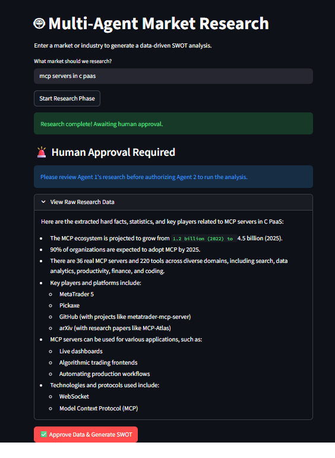
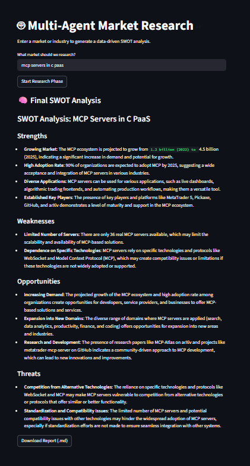

# 🤖 AI Market Research Team (Multi-Agent Workflow)

[](https://www.python.org/)
[](https://share.streamlit.io/)
[](https://python.langchain.com/docs/langgraph)
[](https://groq.com/)

An enterprise-grade, multi-agent AI system built to automate market research and strategic analysis. This application uses an event-driven state graph to coordinate autonomous agents, dynamically search the live web, and feature a Human-in-the-Loop (HITL) breakpoint for data validation.



## 🏗️ Architecture & Workflow

This project moves beyond standard LLM wrappers by implementing a deterministic state machine using **LangGraph**. The workflow executes as follows:

1. **The Researcher Agent (Node 1):** Takes a user-defined industry or topic, dynamically queries the web using DuckDuckGo, and extracts raw, factual market data, statistics, and key players.
2. **Human-in-the-Loop (Breakpoint):** The graph pauses execution and writes the current state to memory. The human operator reviews the raw research in the UI and must explicitly approve the data before consuming further compute resources.
3. **The Analyst Agent (Node 2):** Upon human approval, the state graph resumes. This agent consumes the verified raw data and synthesizes it into a professional, structured SWOT Analysis (Strengths, Weaknesses, Opportunities, Threats).
4. **File Generation:** The final markdown report is provided for immediate download.



## ⚙️ Tech Stack

* **Frontend:** Streamlit (for the interactive HITL interface)
* **Orchestration & State Management:** LangGraph & LangChain
* **LLM Engine:** Groq API (Running `llama-3.3-70b-versatile` for near-instant inference)
* **Tooling:** DuckDuckGo Search API (`ddgs`)

## 🚀 How to Run Locally

If you want to clone this repository and run the agents on your own machine:

1. Clone the repository:
   ```bash
   git clone [https://github.com/YOUR_USERNAME/ai-market-researcher.git](https://github.com/YOUR_USERNAME/ai-market-researcher.git)
   cd ai-market-researcher

   Install the required dependencies:

Bash
pip install -r requirements.txt
Run the Streamlit application:

Bash
streamlit run app.py
Enter your Groq API key in the secure sidebar to begin generating reports.
